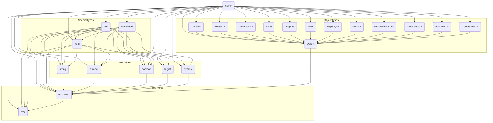

## 严格模式

```mermaid
flowchart TD
    %% never 类型 - 底层类型，可以赋值给任何类型
    Never(never) --> String(string)
    Never --> Number(number)
    Never --> Boolean(boolean)
    Never --> BigInt(bigint)
    Never --> Symbol(symbol)
    Never --> Null(null)
    Never --> Undef(undefined)
    Never --> Void(void)
    Never --> Unknown(unknown)
    Never --> Any(any)
    
    %% never 到对象类型 - 之前遗漏的重要关系
    Never --> ObjectT(Object)
    Never --> FunctionT(Function)
    Never --> ArrayT(Array&lt;T&gt;)
    Never --> PromiseT(Promise&lt;T&gt;)
    Never --> DateT(Date)
    Never --> RegExpT(RegExp)
    Never --> ErrorT(Error)
    Never --> MapT(Map&lt;K,V&gt;)
    Never --> SetT(Set&lt;T&gt;)
    Never --> WeakMapT(WeakMap&lt;K,V&gt;)
    Never --> WeakSetT(WeakSet&lt;T&gt;)
    Never --> IteratorT(Iterator&lt;T&gt;)
    Never --> GeneratorT(Generator&lt;T&gt;)
    
    %% null 和 undefined 只能赋值给 any 和 unknown
    Null --> Unknown
    Undef --> Unknown
    Void --> Unknown
    
    %% 基本类型到 unknown
    String --> Unknown
    Number --> Unknown
    Boolean --> Unknown
    BigInt --> Unknown
    Symbol --> Unknown
    
    %% unknown 到 any
    Unknown --> Any
    
    %% 对象类型层次
    subgraph ObjectTypes
        ObjectT
        FunctionT
        ArrayT
        PromiseT
        DateT
        RegExpT
        ErrorT
        MapT
        SetT
        WeakMapT
        WeakSetT
        IteratorT
        GeneratorT
    end
    
    %% 所有对象类型都继承自 Object
    FunctionT --> ObjectT
    ArrayT --> ObjectT
    PromiseT --> ObjectT
    DateT --> ObjectT
    RegExpT --> ObjectT
    ErrorT --> ObjectT
    MapT --> ObjectT
    SetT --> ObjectT
    WeakMapT --> ObjectT
    WeakSetT --> ObjectT
    IteratorT --> ObjectT
    GeneratorT --> ObjectT
    
    %% 对象类型到 unknown
    ObjectT --> Unknown
    
    %% 基本类型分组
    subgraph Primitives
        String
        Number
        Boolean
        BigInt
        Symbol
    end
    
    %% 特殊类型分组
    subgraph SpecialTypes
        Null
        Undef
        Void
    end
    
    %% 顶级类型分组
    subgraph TopTypes
        Unknown
        Any
    end
```

## 非严格模式

```mermaid
flowchart TD
    %% never 类型 - 底层类型，可以赋值给任何类型
    Never(never) --> String(string)
    Never --> Number(number)
    Never --> Boolean(boolean)
    Never --> BigInt(bigint)
    Never --> Symbol(symbol)
    Never --> Null(null)
    Never --> Undef(undefined)
    Never --> Void(void)
    Never --> Unknown(unknown)
    Never --> Any(any)
    
    %% never 到对象类型 - 之前遗漏的重要关系
    Never --> ObjectT(Object)
    Never --> FunctionT(Function)
    Never --> ArrayT(Array&lt;T&gt;)
    Never --> PromiseT(Promise&lt;T&gt;)
    Never --> DateT(Date)
    Never --> RegExpT(RegExp)
    Never --> ErrorT(Error)
    Never --> MapT(Map&lt;K,V&gt;)
    Never --> SetT(Set&lt;T&gt;)
    Never --> WeakMapT(WeakMap&lt;K,V&gt;)
    Never --> WeakSetT(WeakSet&lt;T&gt;)
    Never --> IteratorT(Iterator&lt;T&gt;)
    Never --> GeneratorT(Generator&lt;T&gt;)
    
    %% null 和 undefined 在非严格模式下可以赋值给更多类型
    Null --> String
    Null --> Number
    Null --> Boolean
    Null --> BigInt
    Null --> Symbol
    Null --> Void
    Null --> Unknown
    Null --> Any
    
    Undef --> String
    Undef --> Number
    Undef --> Boolean
    Undef --> BigInt
    Undef --> Symbol
    Undef --> Void
    Undef --> Unknown
    Undef --> Any
    
    %% void 在非严格模式下可以赋值给更多类型
    Void --> Boolean
    Void --> Number
    Void --> String
    Void --> Unknown
    Void --> Any
    
    %% 基本类型到 unknown
    String --> Unknown
    Number --> Unknown
    Boolean --> Unknown
    BigInt --> Unknown
    Symbol --> Unknown
    
    %% unknown 到 any
    Unknown --> Any
    
    %% 对象类型层次
    subgraph ObjectTypes
        ObjectT
        FunctionT
        ArrayT
        PromiseT
        DateT
        RegExpT
        ErrorT
        MapT
        SetT
        WeakMapT
        WeakSetT
        IteratorT
        GeneratorT
    end
    
    %% 所有对象类型都继承自 Object
    FunctionT --> ObjectT
    ArrayT --> ObjectT
    PromiseT --> ObjectT
    DateT --> ObjectT
    RegExpT --> ObjectT
    ErrorT --> ObjectT
    MapT --> ObjectT
    SetT --> ObjectT
    WeakMapT --> ObjectT
    WeakSetT --> ObjectT
    IteratorT --> ObjectT
    GeneratorT --> ObjectT
    
    %% 对象类型到 unknown
    ObjectT --> Unknown
    
    %% 基本类型分组
    subgraph Primitives
        String
        Number
        Boolean
        BigInt
        Symbol
    end
    
    %% 特殊类型分组
    subgraph SpecialTypes
        Null
        Undef
        Void
    end
    
    %% 顶级类型分组
    subgraph TopTypes
        Unknown
        Any
    end
```
