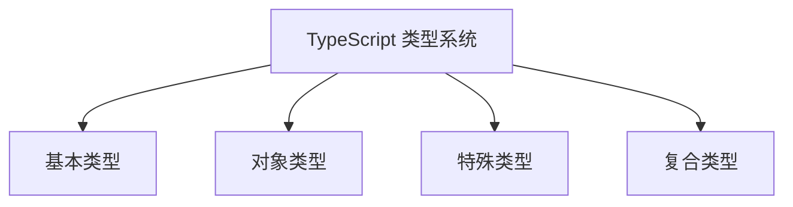
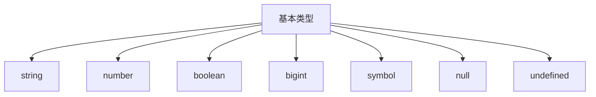
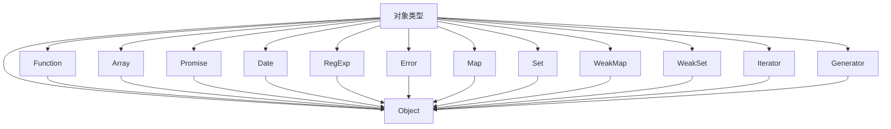
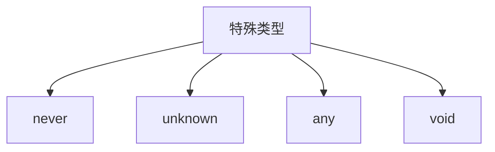
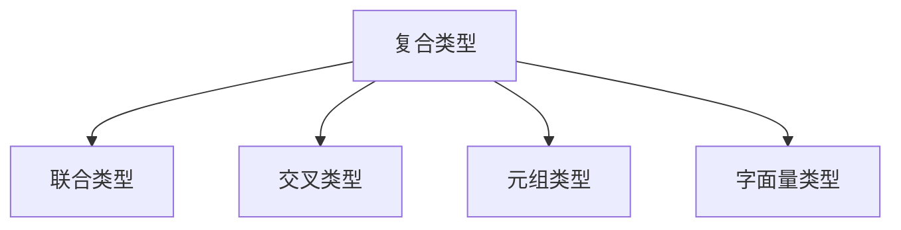
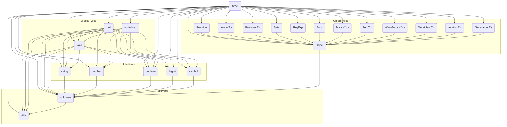
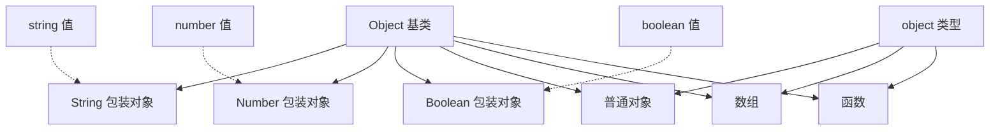

## 类型分类

### 基本类型

### 对象类型

### 特殊类型

### 复合类型

### 所有类型

```mermaid
flowchart TD
    TypeScript[TypeScript 类型系统]
    
    TypeScript --> PrimitiveTypes[基本类型]
    TypeScript --> ObjectTypes[对象类型]
    TypeScript --> SpecialTypes[特殊类型]
    TypeScript --> CompoundTypes[复合类型]
    
    PrimitiveTypes --> String[string]
    PrimitiveTypes --> Number[number]
    PrimitiveTypes --> Boolean[boolean]
    PrimitiveTypes --> BigInt[bigint]
    PrimitiveTypes --> Symbol[symbol]
    PrimitiveTypes --> Null[null]
    PrimitiveTypes --> Undefined[undefined]
    
    ObjectTypes --> Object[Object]
    ObjectTypes --> Function[Function]
    ObjectTypes --> Array[Array]
    ObjectTypes --> Promise[Promise]
    ObjectTypes --> Date[Date]
    ObjectTypes --> RegExp[RegExp]
    ObjectTypes --> Error[Error]
    ObjectTypes --> Map[Map]
    ObjectTypes --> Set[Set]
    ObjectTypes --> WeakMap[WeakMap]
    ObjectTypes --> WeakSet[WeakSet]
    ObjectTypes --> Iterator[Iterator]
    ObjectTypes --> Generator[Generator]
    
    SpecialTypes --> Never[never]
    SpecialTypes --> Unknown[unknown]
    SpecialTypes --> Any[any]
    SpecialTypes --> Void[void]
    
    CompoundTypes --> UnionType[联合类型]
    CompoundTypes --> IntersectionType[交叉类型]
    CompoundTypes --> TupleType[元组类型]
    CompoundTypes --> LiteralType[字面量类型]
    
    Function --> Object
    Array --> Object
    Promise --> Object
    Date --> Object
    RegExp --> Object
    Error --> Object
    Map --> Object
    Set --> Object
    WeakMap --> Object
    WeakSet --> Object
    Iterator --> Object
    Generator --> Object
```

## 严格模式

```mermaid
flowchart TD
    %% never 类型 - 底层类型，可以赋值给任何类型
    Never(never) --> String(string)
    Never --> Number(number)
    Never --> Boolean(boolean)
    Never --> BigInt(bigint)
    Never --> Symbol(symbol)
    Never --> Null(null)
    Never --> Undef(undefined)
    Never --> Void(void)
    Never --> Unknown(unknown)
    Never --> Any(any)
    
    %% never 到对象类型 - 之前遗漏的重要关系
    Never --> ObjectT(Object)
    Never --> FunctionT(Function)
    Never --> ArrayT(Array&lt;T&gt;)
    Never --> PromiseT(Promise&lt;T&gt;)
    Never --> DateT(Date)
    Never --> RegExpT(RegExp)
    Never --> ErrorT(Error)
    Never --> MapT(Map&lt;K,V&gt;)
    Never --> SetT(Set&lt;T&gt;)
    Never --> WeakMapT(WeakMap&lt;K,V&gt;)
    Never --> WeakSetT(WeakSet&lt;T&gt;)
    Never --> IteratorT(Iterator&lt;T&gt;)
    Never --> GeneratorT(Generator&lt;T&gt;)
    
    %% null 和 undefined 只能赋值给 any 和 unknown
    Null --> Unknown
    Undef --> Unknown
    Void --> Unknown
    
    %% 基本类型到 unknown
    String --> Unknown
    Number --> Unknown
    Boolean --> Unknown
    BigInt --> Unknown
    Symbol --> Unknown
    
    %% unknown 到 any
    Unknown --> Any
    
    %% 对象类型层次
    subgraph ObjectTypes
        ObjectT
        FunctionT
        ArrayT
        PromiseT
        DateT
        RegExpT
        ErrorT
        MapT
        SetT
        WeakMapT
        WeakSetT
        IteratorT
        GeneratorT
    end
    
    %% 所有对象类型都继承自 Object
    FunctionT --> ObjectT
    ArrayT --> ObjectT
    PromiseT --> ObjectT
    DateT --> ObjectT
    RegExpT --> ObjectT
    ErrorT --> ObjectT
    MapT --> ObjectT
    SetT --> ObjectT
    WeakMapT --> ObjectT
    WeakSetT --> ObjectT
    IteratorT --> ObjectT
    GeneratorT --> ObjectT
    
    %% 对象类型到 unknown
    ObjectT --> Unknown
    
    %% 基本类型分组
    subgraph Primitives
        String
        Number
        Boolean
        BigInt
        Symbol
    end
    
    %% 特殊类型分组
    subgraph SpecialTypes
        Null
        Undef
        Void
    end
    
    %% 顶级类型分组
    subgraph TopTypes
        Unknown
        Any
    end
```

## 非严格模式

## Object vs object vs {}

- `Object` 是所有对象的基类，包括基本类型的包装对象（如 `String`、`Number` 等）
- `object` 是对象类型，表示非基本类型的值
- `{}` 是对象字面量类型，属于复合类型，可以接受除 `undefined` 和 `null` 之外的任何值

换句话说：
- `Object` 是更宽泛的类型，包含所有对象和基本类型的包装对象
- `object` 是更严格的类型，只包含真正的对象值
- `object` 是 `Object` 的子集，但不是严格的继承关系
- 在实际使用中，`object` 类型更安全，因为它排除了基本类型值

