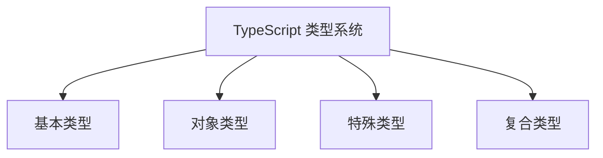
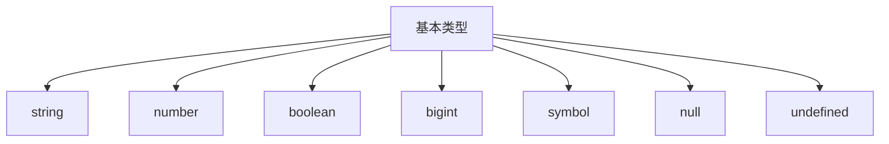
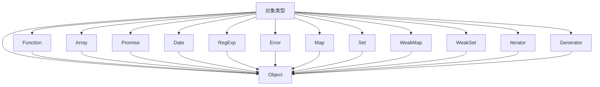
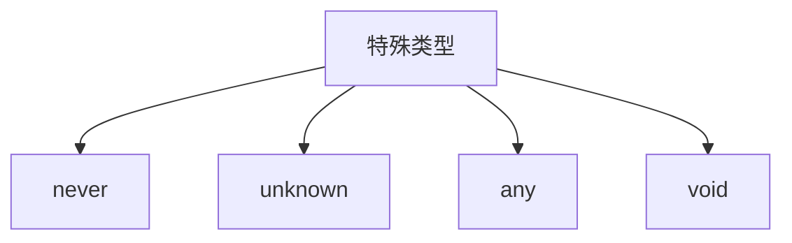
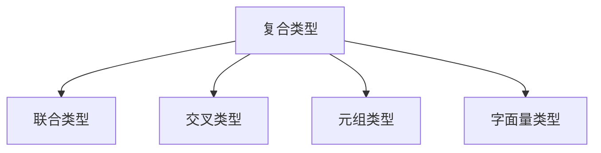
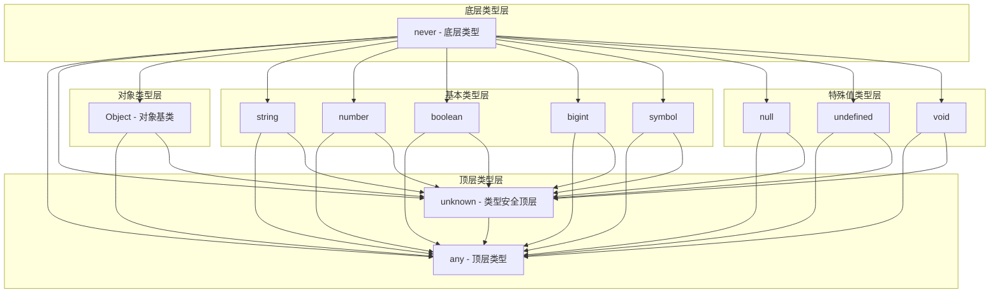
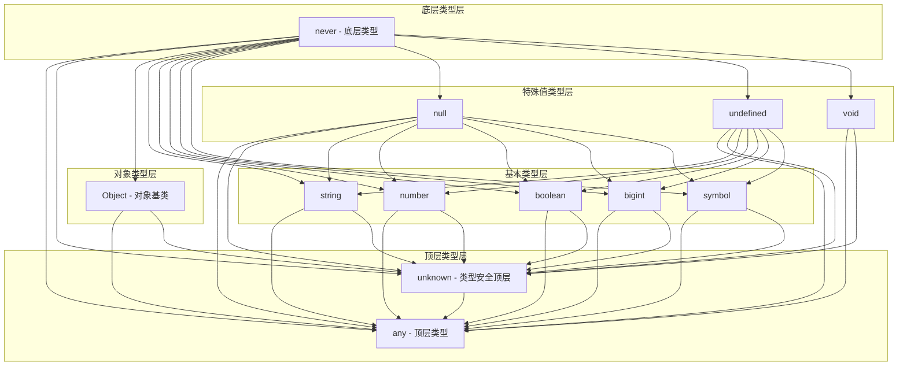

## 类型分类

```mermaid
flowchart TD
    TypeScript[TypeScript 类型系统]
    
    TypeScript --> PrimitiveTypes[基本类型]
    TypeScript --> ObjectTypes[对象类型]
    TypeScript --> SpecialTypes[特殊类型]
    TypeScript --> CompoundTypes[复合类型]
```

### 基本类型

```mermaid
flowchart TD
    PrimitiveTypes[基本类型] --> String[string]
    PrimitiveTypes --> Number[number]
    PrimitiveTypes --> Boolean[boolean]
    PrimitiveTypes --> BigInt[bigint]
    PrimitiveTypes --> Symbol[symbol]
    PrimitiveTypes --> Null[null]
    PrimitiveTypes --> Undefined[undefined]
```

### 对象类型

```mermaid
flowchart TD
    ObjectTypes[对象类型] --> Object[Object]
    ObjectTypes --> Function[Function]
    ObjectTypes --> Array[Array]
    ObjectTypes --> Promise[Promise]
    ObjectTypes --> Date[Date]
    ObjectTypes --> RegExp[RegExp]
    ObjectTypes --> Error[Error]
    ObjectTypes --> Map[Map]
    ObjectTypes --> Set[Set]
    ObjectTypes --> WeakMap[WeakMap]
    ObjectTypes --> WeakSet[WeakSet]
    ObjectTypes --> Iterator[Iterator]
    ObjectTypes --> Generator[Generator]
    
    Function --> Object
    Array --> Object
    Promise --> Object
    Date --> Object
    RegExp --> Object
    Error --> Object
    Map --> Object
    Set --> Object
    WeakMap --> Object
    WeakSet --> Object
    Iterator --> Object
    Generator --> Object
```

### 特殊类型

```mermaid
flowchart TD
    SpecialTypes[特殊类型] --> Never[never]
    SpecialTypes --> Unknown[unknown]
    SpecialTypes --> Any[any]
    SpecialTypes --> Void[void]
```

### 复合类型

```mermaid
flowchart TD
    CompoundTypes[复合类型] --> UnionType[联合类型]
    CompoundTypes --> IntersectionType[交叉类型]
    CompoundTypes --> TupleType[元组类型]
    CompoundTypes --> LiteralType[字面量类型]
```

### 所有类型

```mermaid
flowchart TD
    TypeScript[TypeScript 类型系统]
    
    TypeScript --> PrimitiveTypes[基本类型]
    TypeScript --> ObjectTypes[对象类型]
    TypeScript --> SpecialTypes[特殊类型]
    TypeScript --> CompoundTypes[复合类型]
    
    PrimitiveTypes --> String[string]
    PrimitiveTypes --> Number[number]
    PrimitiveTypes --> Boolean[boolean]
    PrimitiveTypes --> BigInt[bigint]
    PrimitiveTypes --> Symbol[symbol]
    PrimitiveTypes --> Null[null]
    PrimitiveTypes --> Undefined[undefined]
    
    ObjectTypes --> Object[Object]
    ObjectTypes --> Function[Function]
    ObjectTypes --> Array[Array]
    ObjectTypes --> Promise[Promise]
    ObjectTypes --> Date[Date]
    ObjectTypes --> RegExp[RegExp]
    ObjectTypes --> Error[Error]
    ObjectTypes --> Map[Map]
    ObjectTypes --> Set[Set]
    ObjectTypes --> WeakMap[WeakMap]
    ObjectTypes --> WeakSet[WeakSet]
    ObjectTypes --> Iterator[Iterator]
    ObjectTypes --> Generator[Generator]
    
    SpecialTypes --> Never[never]
    SpecialTypes --> Unknown[unknown]
    SpecialTypes --> Any[any]
    SpecialTypes --> Void[void]
    
    CompoundTypes --> UnionType[联合类型]
    CompoundTypes --> IntersectionType[交叉类型]
    CompoundTypes --> TupleType[元组类型]
    CompoundTypes --> LiteralType[字面量类型]
    
    Function --> Object
    Array --> Object
    Promise --> Object
    Date --> Object
    RegExp --> Object
    Error --> Object
    Map --> Object
    Set --> Object
    WeakMap --> Object
    WeakSet --> Object
    Iterator --> Object
    Generator --> Object
```

## 类型赋值关系

### 严格模式

```mermaid
flowchart TD
    %% 底层类型
    Never[never - 底层类型]
    
    %% 第四层 - 特殊值类型
    Null[null]
    Undefined[undefined]
    Void[void]
    
    %% 第三层 - 基本类型
    String[string]
    Number[number]
    Boolean[boolean]
    BigInt[bigint]
    Symbol[symbol]
    
    %% 第二层 - 对象类型
    Object[Object - 对象基类]
    
    %% 顶层类型
    Any[any - 顶层类型]
    Unknown[unknown - 类型安全顶层]
    
    %% 正确的赋值关系
    Never --> Any
    Never --> Unknown
    Never --> Object
    Never --> String
    Never --> Number
    Never --> Boolean
    Never --> BigInt
    Never --> Symbol
    Never --> Null
    Never --> Undefined
    Never --> Void
    
    %% 基本类型和对象类型可以赋值给 unknown 和 any
    String --> Any
    String --> Unknown
    Number --> Any
    Number --> Unknown
    Boolean --> Any
    Boolean --> Unknown
    BigInt --> Any
    BigInt --> Unknown
    Symbol --> Any
    Symbol --> Unknown
    
    Object --> Any
    Object --> Unknown
    
    %% 特殊值类型只能赋值给 unknown 和 any
    Null --> Any
    Null --> Unknown
    Undefined --> Any
    Undefined --> Unknown
    Void --> Any
    Void --> Unknown
    
    %% unknown 可以赋值给 any
    Unknown --> Any
    
    %% 分组
    subgraph BottomLevel[底层类型层]
        Never
    end
    
    subgraph SpecialLevel[特殊值类型层]
        Null
        Undefined
        Void
    end
    
    subgraph PrimitiveLevel[基本类型层]
        String
        Number
        Boolean
        BigInt
        Symbol
    end
    
    subgraph ObjectLevel[对象类型层]
        Object
    end
    
    subgraph TopLevel[顶层类型层]
        Any
        Unknown
    end
```

### 非严格模式

```mermaid
flowchart TD
    %% 底层类型
    Never[never - 底层类型]
    
    %% 第四层 - 特殊值类型
    Null[null]
    Undefined[undefined]
    Void[void]
    
    %% 第三层 - 基本类型
    String[string]
    Number[number]
    Boolean[boolean]
    BigInt[bigint]
    Symbol[symbol]
    
    %% 第二层 - 对象类型
    Object[Object - 对象基类]
    
    %% 顶层类型
    Any[any - 顶层类型]
    Unknown[unknown - 类型安全顶层]
    
    %% 正确的赋值关系
    Never --> Any
    Never --> Unknown
    Never --> Object
    Never --> String
    Never --> Number
    Never --> Boolean
    Never --> BigInt
    Never --> Symbol
    Never --> Null
    Never --> Undefined
    Never --> Void
    
    %% 基本类型和对象类型可以赋值给 unknown 和 any
    String --> Any
    String --> Unknown
    Number --> Any
    Number --> Unknown
    Boolean --> Any
    Boolean --> Unknown
    BigInt --> Any
    BigInt --> Unknown
    Symbol --> Any
    Symbol --> Unknown
    
    Object --> Any
    Object --> Unknown
    
    %% 非严格模式下的额外赋值关系 - 只有 null 和 undefined
    Null --> Any
    Null --> Unknown
    Null --> String
    Null --> Number
    Null --> Boolean
    Null --> BigInt
    Null --> Symbol
    
    Undefined --> Any
    Undefined --> Unknown
    Undefined --> String
    Undefined --> Number
    Undefined --> Boolean
    Undefined --> BigInt
    Undefined --> Symbol
    
    %% void 类型始终只能赋值给 unknown 和 any
    Void --> Any
    Void --> Unknown
    
    %% unknown 可以赋值给 any
    Unknown --> Any
    
    %% 分组
    subgraph BottomLevel[底层类型层]
        Never
    end
    
    subgraph SpecialLevel[特殊值类型层]
        Null
        Undefined
        Void
    end
    
    subgraph PrimitiveLevel[基本类型层]
        String
        Number
        Boolean
        BigInt
        Symbol
    end
    
    subgraph ObjectLevel[对象类型层]
        Object
    end
    
    subgraph TopLevel[顶层类型层]
        Any
        Unknown
    end
```
